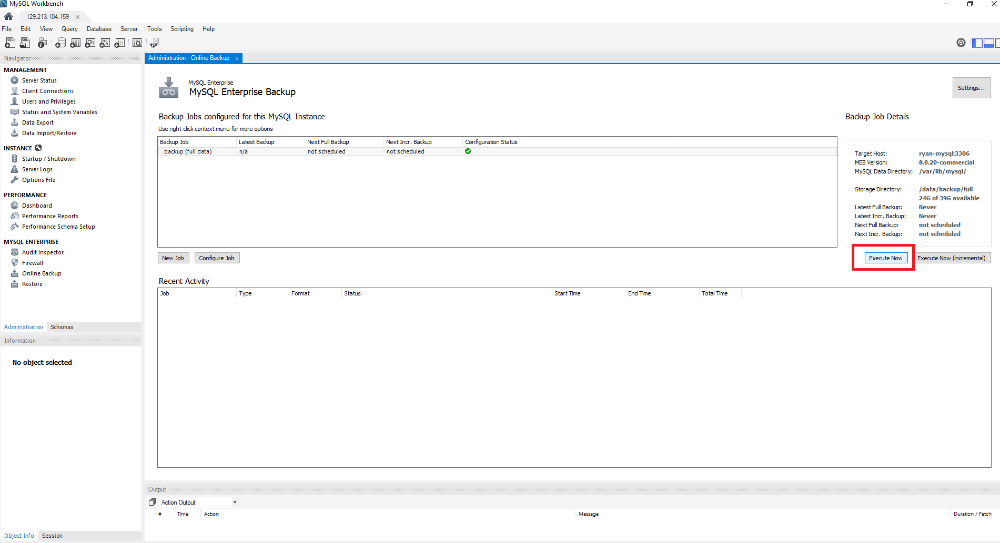

# Test Drive 2: Backing up data

One of the most important tasks of working with database engine is to backup the data to prepare for unforeseen situations when data needs to be restored from backup

**MySQL Enterprise Backup** is a must-have tool for data backup and restore. It is designed for 24x7 data operations where database engine is not allowed to be shutdown and you need to run your backup task online without impacting the data operation

## Backing up data using MySQL Enterprise Backup

In the **Administration** tab, select **Online Backup**

1. Configure the basic MySQL Enterprise Backup settings


2. Create a backup job, click on **New Job**


3. Specify the ``backup directory`` **/data/backup**, click on **Save and Reschedule**


4. Execute the backup job 



5. Backup complted


## Comparing MySQL Enterprise Backup with mysqldump

**MySQL Enterprise Backup** is an essential tool for enterprise database deployment. Besides *mysqlbackup* there is a database export tool, ``mysqldump`` utility to export the data by writing out data row one by one to in a single SQL file as database backup, this is the only tool available in MySQL Community Edition. If the database size is large, say more than 1TB, the data export process will take a long time to complete, and restoring data by using the ``mysqldump`` will take more than triple of the export time. 

The most reliable data backup option is to use 
> **MySQL Enterprise Backup** feature to backup/restore data faster and safer
> **MySQL Enterprise Backup** backup the _physical_ data files therefore it is very fast comparing to ``mysqldump``

You must use **MySQL Enterprise Backup** to backup your important data becuase data is now a corporate asset and it has to be treated with utmost importance. You can export data in row format as an additional data copy but you must use **MySQL Enterprise Backup** as your main backup tool

## Comparison of **mysqlbackup** and **mysqldump**

We will run both **mysqlbackup** and **mysqldump** to compare the backup performance so that you would appreciate the value of using an enterprise-grade backup tool for your mission critical database

In this quick lab, ``ssh`` to the compute instance

1. Run mysqldump 

```
cd ~/TestDrive/testdriver-2
./01-mysqldump.sh
```
At the end of the script, please note the time taken for the mysqldump

```
real    0m33.696s
user    0m13.976s
sys     0m1.719s
```

2. Run mysqlbackup

```
cd ~/TestDrive/testdriver-2
./02-med-backup-image.sh
```
At the end of the script, please note the time taken for the mysqldump

```
real    2m34.512s
user    0m3.330s
sys     0m6.241s
```

To compare the time (the actual execution of the backup process which are *user* and *sys* time) taken of mysqldump ``15.695s`` (13.976s + 1.719s) and mysqlbackup ``9.571s`` (3.333s + 6.241s)


Clearly mysqlbackup is faster than mysqldump.
