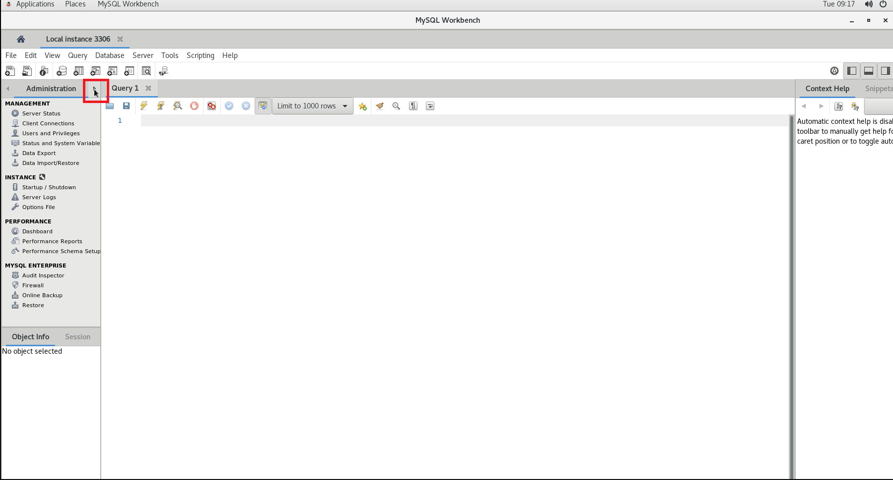
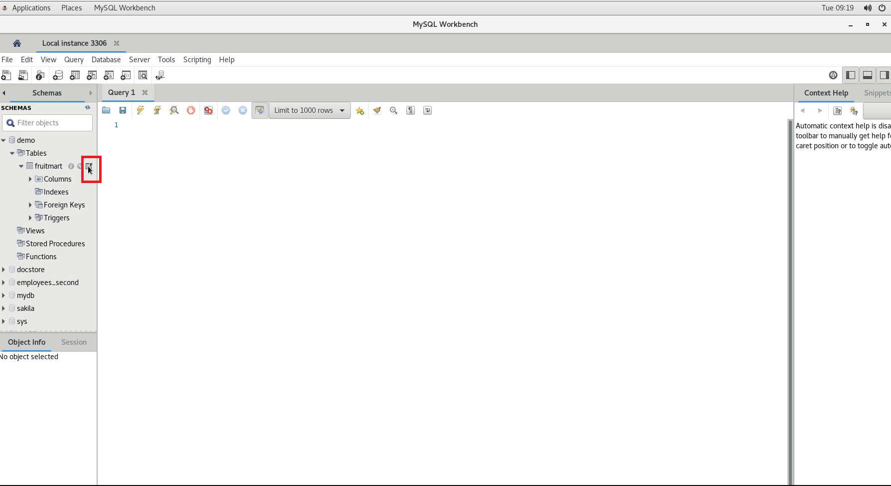
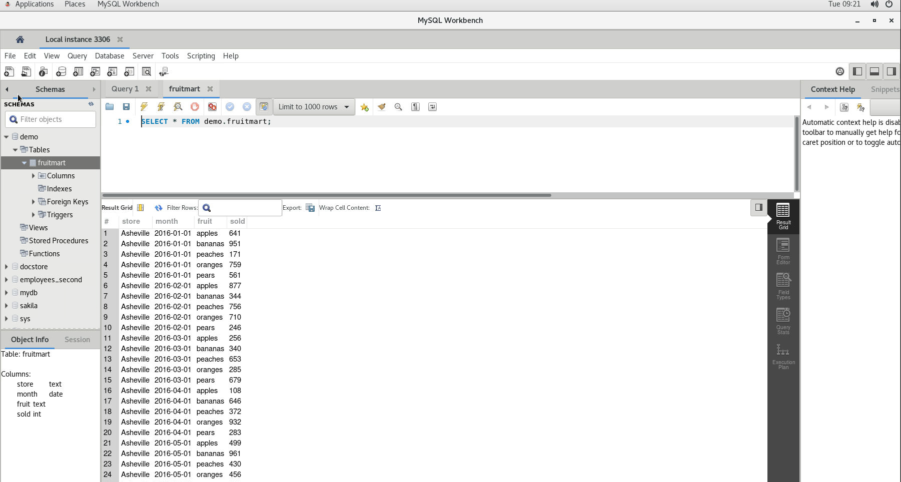
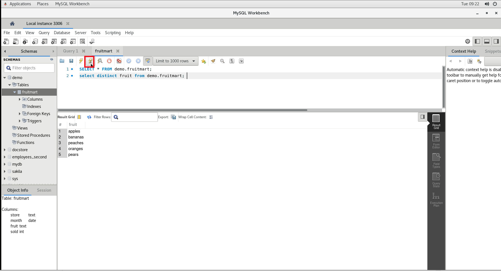
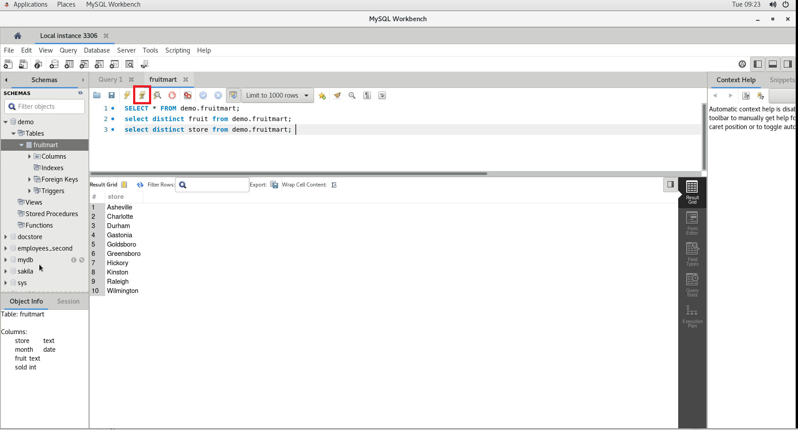
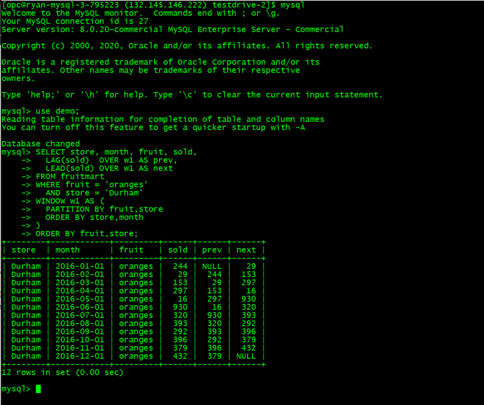

# Test Drive 3: Solving business problems with SQL

Data is now considered the most valuable corporate asset for most digital and social enterprises, startups and traditional enterprise businesses. Business strategy is now driven by analysing massive amount of data ingested from vast variety of sources such as web-clicks, mobile application, location-based data and others. 

In order to turn these massive data into insights and information we can use, we will need to use SQL to extract and process the data to provide meaningful information

MySQL can be used as a powerful analysis engine to answer and solve your questions and business problems using sophisticated and powerful **Window** functions

## Analyze sales performance of Fruit stores
We will use a data set consisting of sales data of a chain fruit stores across major cities in the US. 

Run the following queries in **MySQL Workbench**
1. First, you will need to switch to the **Schema** view


2. Expand the **demo** database, select the right icon on the **fruitmart** table to retrieve data from the table



Poke around the data and find out answers to these questions:

2a. Copy and paste the following SQL statement in the **Query 1** window, click the highlighted icon to run the SQL

* How many types of fruits the stores sell?
```
select distinct fruit from demo.fruitmart;
```


* How many stores?
```
select distinct store from demo.fruitmart;
```



For the next few SQL, run the following queries in your ssh terminal

```
mysql
use demo;
```

3. Find out the sales of orange for a Durham store comparing sales performance of current, previous and the following month

We use LAG() (lagging from previous sales figure) and LEAD() (leading to the following sales figure) to compare with current sales figure. Don't get frustrated if you don't understand the syntax for now, just look at the outcome of using these Window functions, appreciate how fast and simple to use **Window** function

```
SELECT store, month, fruit, sold,
  LAG(sold)  OVER w1 AS prev,
  LEAD(sold) OVER w1 AS next
FROM fruitmart
WHERE fruit = 'oranges'
  AND store = 'Durham'
WINDOW w1 AS (
  PARTITION BY fruit,store
  ORDER BY store,month
)
ORDER BY fruit,store;
```



4. Rank the sales of oranges for the Durham store

Lets find out more about the sales pattern of oranges in Durham by ranking the sales by month
```
SELECT store, month, fruit, sold,
  LAG(sold)       OVER w1  AS prev,
  LEAD(sold)      OVER w1  AS next,
  ROUND(AVG(sold) OVER w3) AS avg,
  RANK()          OVER w2  AS rnk
FROM fruitmart
WHERE fruit = 'oranges'
  AND store = 'Durham'
WINDOW
  w1 AS (
    PARTITION BY fruit,store
    ORDER BY store,month
  ),
  w2 AS (
    PARTITION BY fruit,store
    ORDER BY sold DESC
  ),
  w3 AS (w2
    ROWS BETWEEN
      UNBOUNDED PRECEDING
      AND
      UNBOUNDED FOLLOWING
  )
ORDER BY fruit,store,rnk;
```

5. Rank the oranges sales with **all** the stores

Lets find out which store tops the orange sales among all the stores

```
SELECT store, month, fruit, sold,
  LAG(sold)       OVER w1  AS prev,
  LEAD(sold)      OVER w1  AS next,
  ROUND(AVG(sold) OVER w4) AS s_avg,
  ROUND(AVG(sold) OVER w3) AS a_avg,
  RANK()          OVER w2  AS rnk
FROM fruitmart
WHERE fruit = 'oranges'
WINDOW
  w1 AS (
    PARTITION BY fruit,store
    ORDER BY store,month
  ),
  w2 AS (
    PARTITION BY fruit
    ORDER BY sold DESC
  ),
  w3 AS (w2
    ROWS BETWEEN
      UNBOUNDED PRECEDING
      AND
      UNBOUNDED FOLLOWING
  ),
  w4 AS (
    PARTITION BY fruit,store
    ORDER BY sold DESC
    ROWS BETWEEN
      UNBOUNDED PRECEDING
      AND
      UNBOUNDED FOLLOWING
  )
ORDER BY fruit,rnk;
```

## [BONUS] Solving interesting problem with SQL

Besides solving business problems by analysing data to gain insights into business problem, we can have a bit of fun using MySQL to solve complicated problem such as **Sudoku**. We are going to use another powerful MySQL function, **WITH RECURSIVE** to solve Sudoku puzzle

1. We will first define the Sudoku puzzle

```
mysql -uroot -h127.0.0.1 -P3306 -p
select @myproblem:='..41..2.3........12.....8..82.6.43.....8.9.....67.2.48..5.....64........3.7..69..';


WITH RECURSIVE
        my19(n) AS (
        SELECT 1 AS n
        UNION ALL
        SELECT 1+n FROM my19 WHERE n<9
)
select substr(@myproblem,(n-1)*9+1,9) as sud from my19;

+-----------+
| sud       |
+-----------+
| ..41..2.3 |
| ........1 |
| 2.....8.. |
| 82.6.43.. |
| ...8.9... |
| ..67.2.48 |
| ..5.....6 |
| 4........ |
| 3.7..69.. |
+-----------+
```

2. We will start the clock to measure how long does it take to use SQL to solve a Sudoku puzzle. Again don't be frustrated if you don't understand the SQL, not many people can write complicated SQL on day one

```
select @t:=sysdate(6);

WITH RECURSIVE
        input(sud) as (
        select @myproblem
),
        digits(z,lp) as (
        select '1', 1
        union all
        select cast(lp+1 as char), lp+1 from digits where lp<9
),
        x(s,ind) as (
        select sud, instr(sud,'.') from input
        union all
        select concat(substr(s,1, ind-1), z, substr(s, ind+1)),
        instr( concat(substr(s,1,ind-1), z, substr(s, ind+1)), '.')
        from x, digits as z
        where ind> 0
        and not exists (
                select 1 from digits as lp
                where z.z = substr(s, ((ind-1) div 9) *9 + lp, 1)
                or z.z = substr(s, ((ind-1)%9) + (lp-1) *9 + 1, 1)
                or z.z = substr(s, (((ind-1) div 3) %3) * 3
                        + ((ind-1) div 27 ) * 27 + lp
                        + ((lp-1) div 3) * 6, 1)
                )
),
        my19(n) AS (
        SELECT 1 AS n
        UNION ALL
        SELECT 1+n FROM my19 WHERE n<9
)
select substr(s,(n-1)*9 + 1,9) as ans from x,my19 where ind=0;
```

3. The Puzzle is solved!

```

+-----------+
| ans       |
+-----------+
| 574198263 |
| 638425791 |
| 219367854 |
| 821654379 |
| 743819625 |
| 956732148 |
| 195273486 |
| 462981537 |
| 387546912 |
+-----------+
```

4. The total time taken just for fun!
```
select @t as start_time, timediff(sysdate(6),@t);
```
