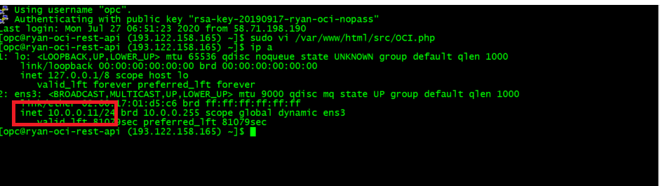
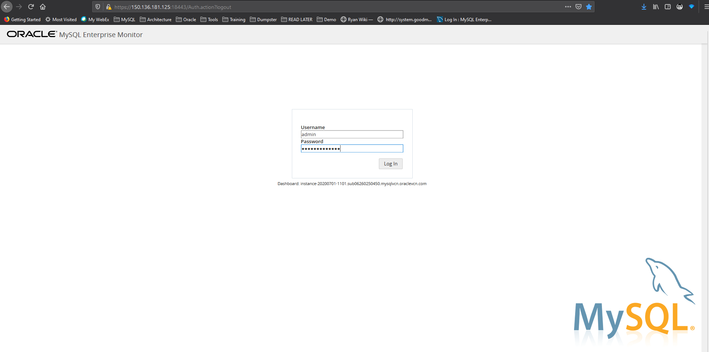
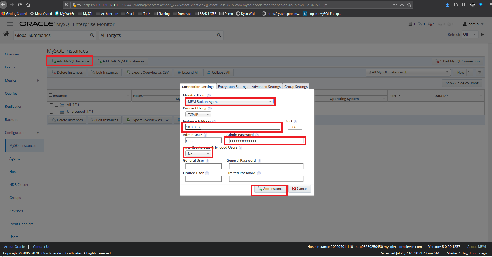
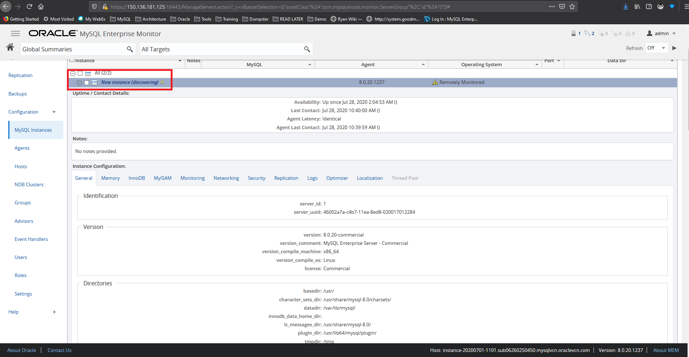
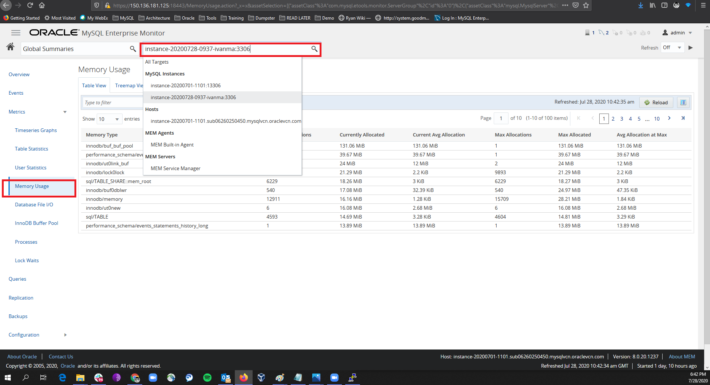

# Test Drive 5: Monitoring the MySQL engine

You can't manage something that you don't monitor. To keep the database engine running smoothly and to support your mission critical workloads, you need to have a monitoring solution for the database engine.
MySQL Enterprise Monitor is a robust, simple to use, out-of-the-box monitoring solution for MySQL database engine

## Start monitoring your engine
0. First, find out your ip address of the assigned compute instance, take note of this ip address
```
ip a
```


1. Point your browser to https://xx.xx.xx.xx:18443/monitor, login using user **admin**


2. Add your database engine to the dashboard. Select **Configuration**, **MySQL Instances**, click on **Add MySQL Instance**. Make sure you enter the correct IP address and all the values highlighted in the diagram


3. Once your database is successfully added, you can start monitoring your database. Select **MySQL Instances**, expand your newly added instance


4. Select **Metrics**, **Memory Usage**, select your instace from the drop down list


That's it, you are free to navigate the dashboard to discover more about MySQL!
