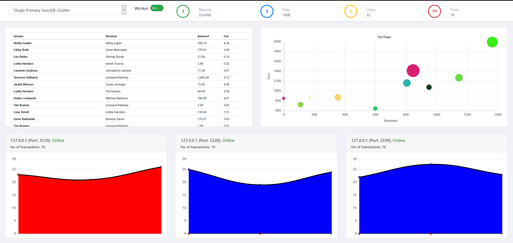

# Test Drive 6: Building highly available database cluster  

Having a robust and reliable database engine is not good enough for support mission critical workloads such as a web-scaled application, moible applications, gaming website and other cloud-native applications
The database engine needs to be highly available with built-in clustering capabilities with fully redundant database engines. You can build a cluster solution with 3 MySQL InnoDB engines to provide high availability solution for your mission critical workloads

## Building MySQL database cluster
We will build a MySQL InnoDB Cluster that requires minimum of 3 MySQL servers. There are 3 MySQL servers configured already, so we just need to create the InnoDB Cluster, and add the MySQL Servers to the cluster

1. Create a cluster and add these database engines to the cluster

First of all, we will make sure the 3 MySQL Servers are ready to be deployed to the InnoDB Cluster

```
cd /home/opc/TestDrive/testdrive-6
./01-checkConfig.sh
```

Hit **Enter** when prompted for password for root@localhost
```
[opc@instance-20200803-1826-ryan-test (150.136.237.248) testdrive-6]$ ./01-checkConfig.sh
Please provide the password for 'root@localhost:3310':
Save password for 'root@localhost:3310'? [Y]es/[N]o/Ne[v]er (default No):
Validating local MySQL instance listening at port 3310 for use in an InnoDB cluster...

This instance reports its own address as instance-20200803-1826-ryan-test:3310
Clients and other cluster members will communicate with it through this address by default. If this is not correct, the report_host MySQL system variable should be changed.

Checking whether existing tables comply with Group Replication requirements...
No incompatible tables detected

Checking instance configuration...
Instance configuration is compatible with InnoDB cluster

The instance 'instance-20200803-1826-ryan-test:3310' is valid to be used in an InnoDB cluster.

Please provide the password for 'root@localhost:3320':
Save password for 'root@localhost:3320'? [Y]es/[N]o/Ne[v]er (default No):
Validating local MySQL instance listening at port 3320 for use in an InnoDB cluster...

This instance reports its own address as instance-20200803-1826-ryan-test:3320
Clients and other cluster members will communicate with it through this address by default. If this is not correct, the report_host MySQL system variable should be changed.

Checking whether existing tables comply with Group Replication requirements...
No incompatible tables detected

Checking instance configuration...
Instance configuration is compatible with InnoDB cluster

The instance 'instance-20200803-1826-ryan-test:3320' is valid to be used in an InnoDB cluster.

Please provide the password for 'root@localhost:3330':
Save password for 'root@localhost:3330'? [Y]es/[N]o/Ne[v]er (default No):
Validating local MySQL instance listening at port 3330 for use in an InnoDB cluster...

This instance reports its own address as instance-20200803-1826-ryan-test:3330
Clients and other cluster members will communicate with it through this address by default. If this is not correct, the report_host MySQL system variable should be changed.

Checking whether existing tables comply with Group Replication requirements...
No incompatible tables detected

Checking instance configuration...
Instance configuration is compatible with InnoDB cluster

The instance 'instance-20200803-1826-ryan-test:3330' is valid to be used in an InnoDB cluster.


```
Next, we will configure the MySQL server with a cluster admin user to be ready to deploy to InnoDB Cluster.

```
./02-configInstance.sh
Configuring local MySQL instance listening at port 3310 for use in an InnoDB cluster...

This instance reports its own address as ryan-mysql-3-795223:3310
Clients and other cluster members will communicate with it through this address by default. If this is not correct, the report_host MySQL system variable should be changed.
Assuming full account name 'clusterAdmin'@'%' for clusterAdmin

NOTE: Some configuration options need to be fixed:
+--------------------------+---------------+----------------+--------------------------------------------------+
| Variable                 | Current Value | Required Value | Note                                             |
+--------------------------+---------------+----------------+--------------------------------------------------+
| binlog_checksum          | CRC32         | NONE           | Update the server variable                       |
| enforce_gtid_consistency | OFF           | ON             | Update read-only variable and restart the server |
| gtid_mode                | OFF           | ON             | Update read-only variable and restart the server |
| server_id                | 1             | <unique ID>    | Update read-only variable and restart the server |
+--------------------------+---------------+----------------+--------------------------------------------------+

Some variables need to be changed, but cannot be done dynamically on the server.
Do you want to perform the required configuration changes? [y/n]: y
Do you want to restart the instance after configuring it? [y/n]: y
```

Finally, we can start creating the InnoDB Cluster, select **Clone** when prompted on "Please select recovery method",
and Press **Enter** when prompted for password for clusterAdmin

```
03-createCluster.sh

The instance 'localhost:3330' was successfully added to the cluster.

{
    "clusterName": "mycluster",
    "defaultReplicaSet": {
        "name": "default",
        "primary": "workshop6:3310",
        "ssl": "REQUIRED",
        "status": "OK",
        "statusText": "Cluster is ONLINE and can tolerate up to ONE failure.",
        "topology": {
            "workshop6:3310": {
                "address": "workshop6:3310",
                "mode": "R/W",
                "readReplicas": {},
                "replicationLag": null,
                "role": "HA",
                "status": "ONLINE",
                "version": "8.0.20"
            },
            "workshop6:3320": {
                "address": "workshop6:3320",
                "mode": "R/O",
                "readReplicas": {},
                "replicationLag": null,
                "role": "HA",
                "status": "ONLINE",
                "version": "8.0.20"
            },
            "workshop6:3330": {
                "address": "workshop6:3330",
                "mode": "R/O",
                "readReplicas": {},
                "replicationLag": null,
                "role": "HA",
                "status": "ONLINE",
                "version": "8.0.20"
            }
        },
        "topologyMode": "Single-Primary"
    },
    "groupInformationSourceMember": "workshop6:3310"
    
```

2. Createt the router to connect to MySQL InnoDB cluster

```
./04-createCluster.sh
```


3. Test the cluster

## [BONUS] Test the cluster


1. Start the web server, and point your browser to http://ip_address/demo
```
sudo systemctl restart httpd
```

2. Select **Single Primary Cluster**, and start hitting the cluster



3. Similate database engine failure by shutting down one of the engine

```
sudo systemctl stop mysqld@mysql01
```

Take note on how the cluster nominate the surviving MySQL Server to be the Primary Server (Read/Write node) to serve the application. 

4. Bring up the database engine and see how it joins the cluster automatically

```
sudo systemctl start mysqld@mysql01
```

Observe how the MySQL server synchronize missing transactions while it was shutdown and rejoins the cluster once the transactions are applied and in sync with the cluster members

