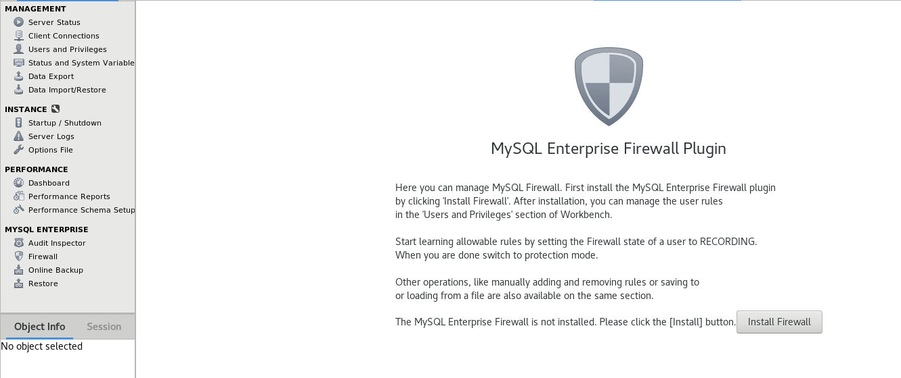
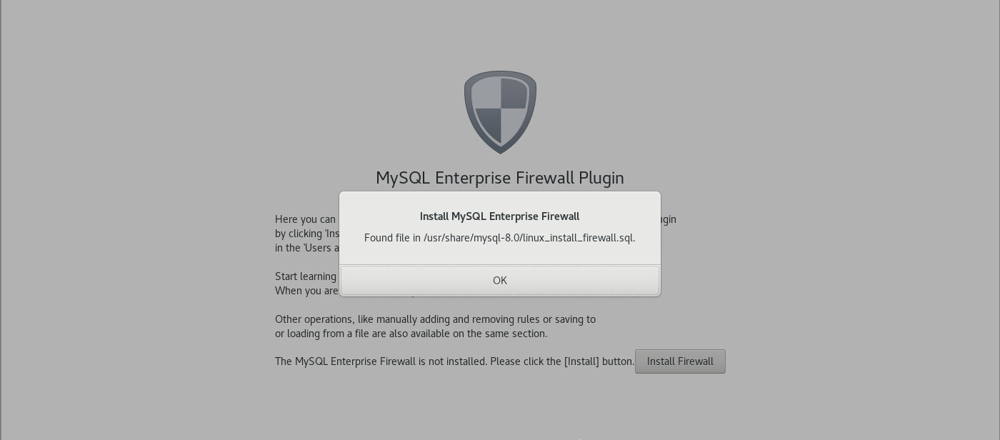
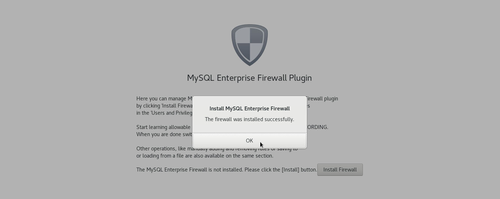
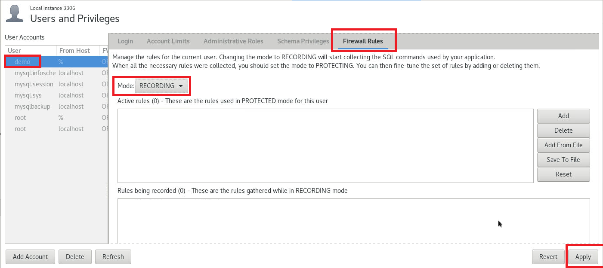
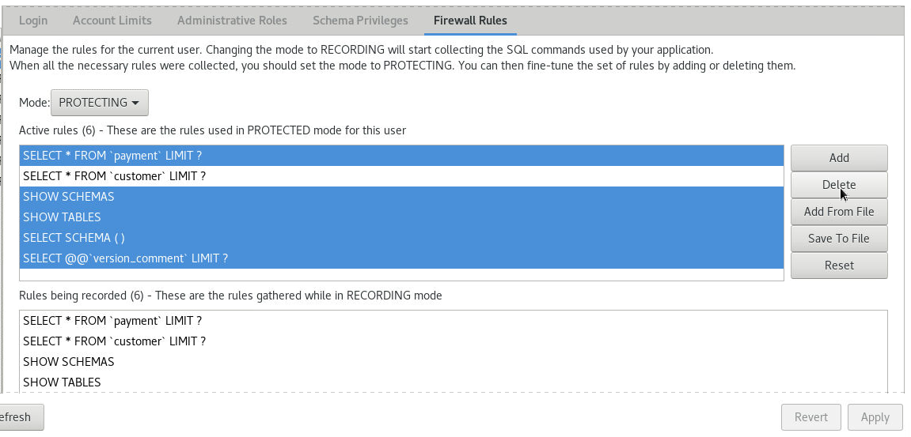

# MySQL Enterprise Firewall

You can enable MySQL Enterprise Firewall using MySQL Workbench
* Click on **Firewall** in left panel of Workbench


* Click on **Install Firewall**


* Fiewall successfully installed


* Next, select the user **demo**, select the tab **Firewall Rules**, turn on **Recording** mode


* In another terminal, login to database using user **demo**
```
mysql -udemo -h127.0.0.1 -P3306 -p
mysql> 
use sakila;
select * from customer limit 10;
select * from payment limit 5;
\q
```
* Back to Workbench, switch the **Recording** mode to **Protecting** mode, and remove all the SQL statements except **SELECT * FROM customer LIMIT 10**, click on **Apply**


* Back to terminal to test the firewall rule
```
mysql -udemo -h127.0.0.1 -P3306 -p
mysql> 
use sakila;
select * from customer limit 10;
select * from payment limit 5;
\q
```

