# Preparation
In this lab, we will need to set up our connectivity to Oracle Cloud Infrastructure to access the compute instance provisioned with MySQL server

## Installing and Using SSH to work with MySQL/OCI
We will be using ``ssh`` to connect to the compute instance running Oracle Linux
For Windows, please install ``putty`` or use your favourite ssh tools
* Download putty from https://www.putty.org/

For MacOS, you can can use ``ssh`` in Mac terminal

### To configure putty in Windows

1. Specify the ``ip address`` and ``port`` (22)

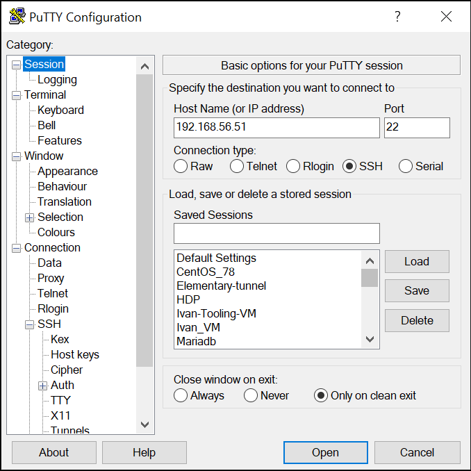

2. Select "Connection->Data", specify the login username ``opc``

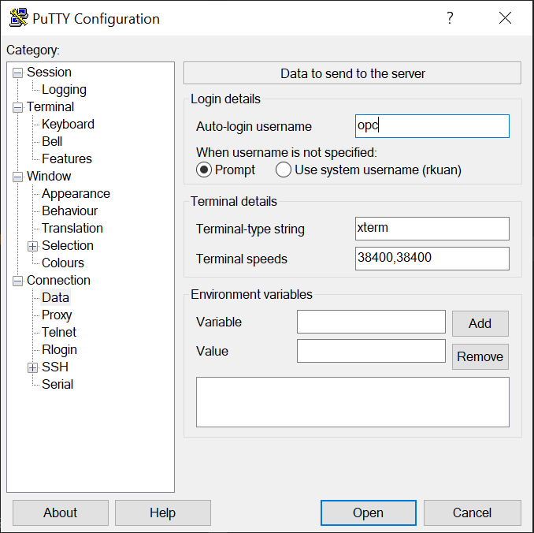

3. Save the session as **mysql-oci** so that you can reuse later and to create the tunnel configuration later

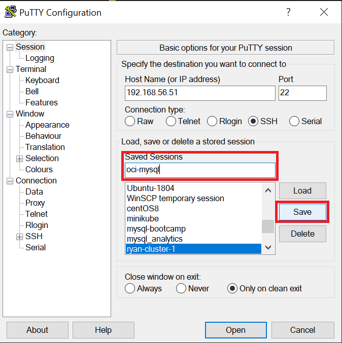

4. Select "SSH->Tunnels", add a ``port`` (5901), ``destination`` (localhost:5901), click "Add"

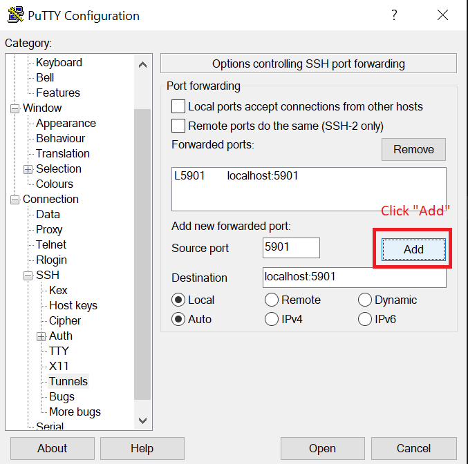

5. Save the session as **mysql-oci-tunnel**

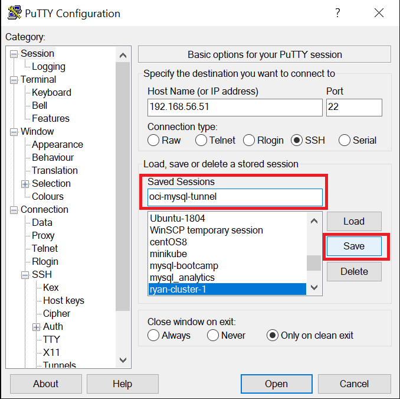

### To use ssh in Mac

```
ssh opc@ip_address
```

## Installing and using VNCViewer/TightVNC to work with MySQL Workbench

1. Download and install **VNC Viewer** or **TightVNC** on Windows/Mac
2. ssh using **mysql-oci-tunnel** using putty or ssh
3. Start vncserver

```
vncserver
ps -ef | grep vnc
```

## Configuring MySQL Workbench

0. Before you launch VNC Viewer or TighVNC, **make sure** that you have started the **mysql-oci-tunnel**
1. In your laptop, Start VNC Viewer or TigthVNC
2. Specify local connection ``localhost:5901``

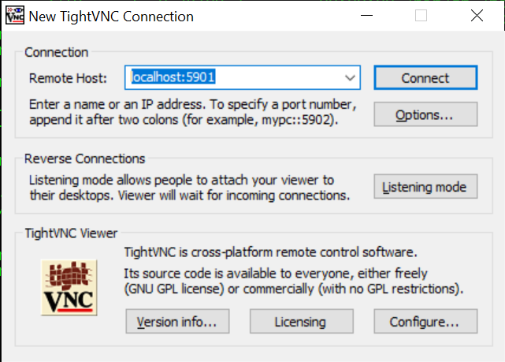

3. Enter password when prompted

4. Start **MySQL Workbench**

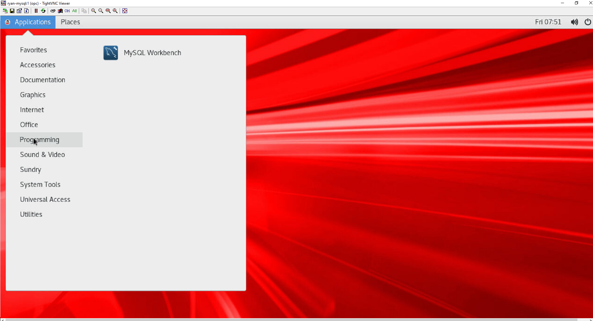

5. (optional) You can adjust the windows size in TightVNC to work better for you

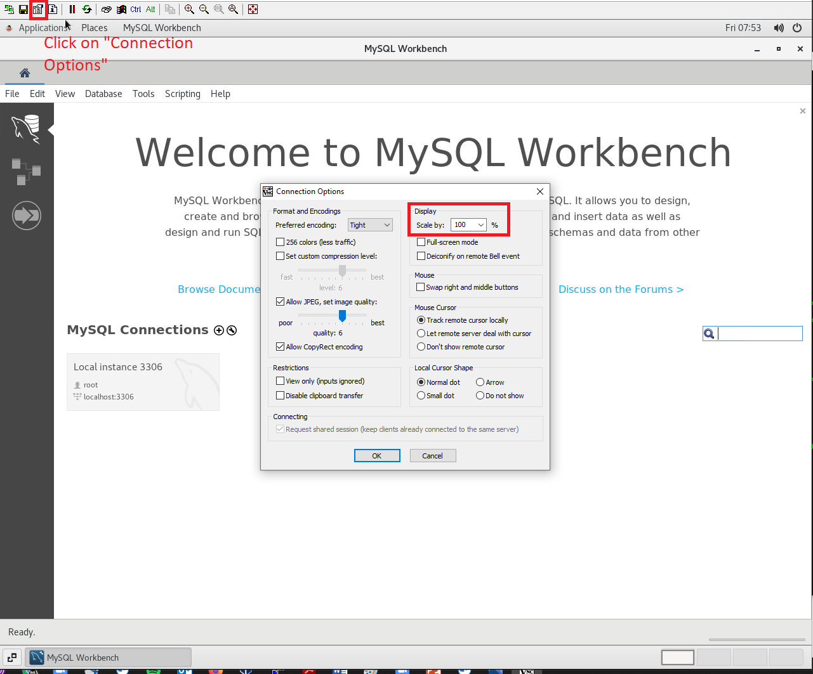

6. Right click on the **Local Instance 3306**, **Edit Connection**

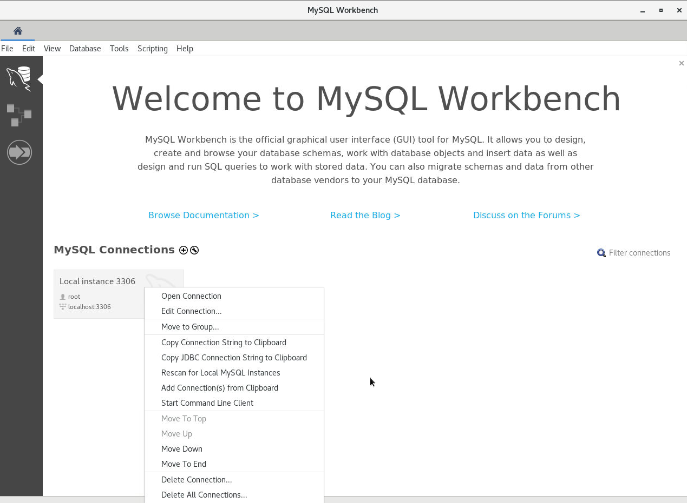

7. Configure the System Profile to specify **Oracle Linux 7** and **Save**

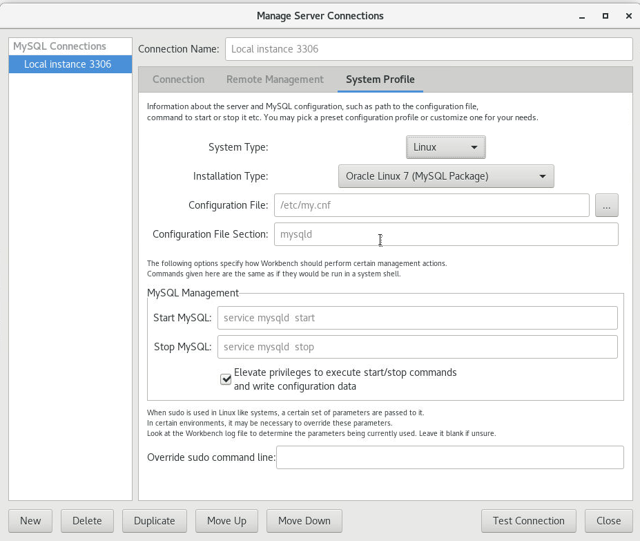

8. Double-click the **Local Instance 3306**, enter the **root** password

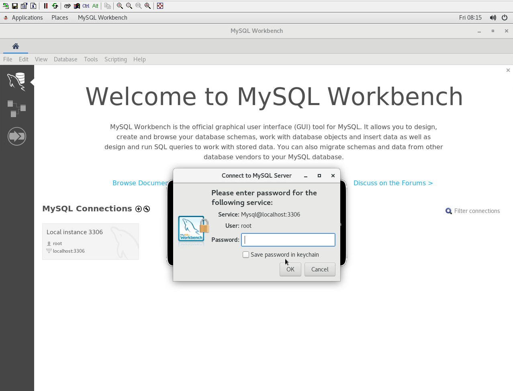


## [OPTIONAL] Install MySQL Workbench Enterprise 
We will be using **MySQL Workbench Enterprise** to work with MySQL Server
The installation package is stored at the compute instance assigned to you, you can download the installation package from the compute instance using ``winscp`` or any other scp utility programs

Use ``winscp`` to download the package

1. Enter the ``ip address`` assigned to you, enter user name ``opc`` and the password. There will be 2 windows panels:
* Left window display your local directory
* right window display the remote directory

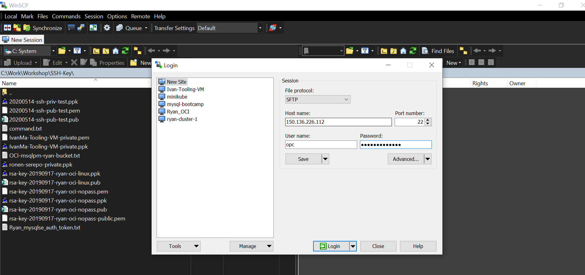

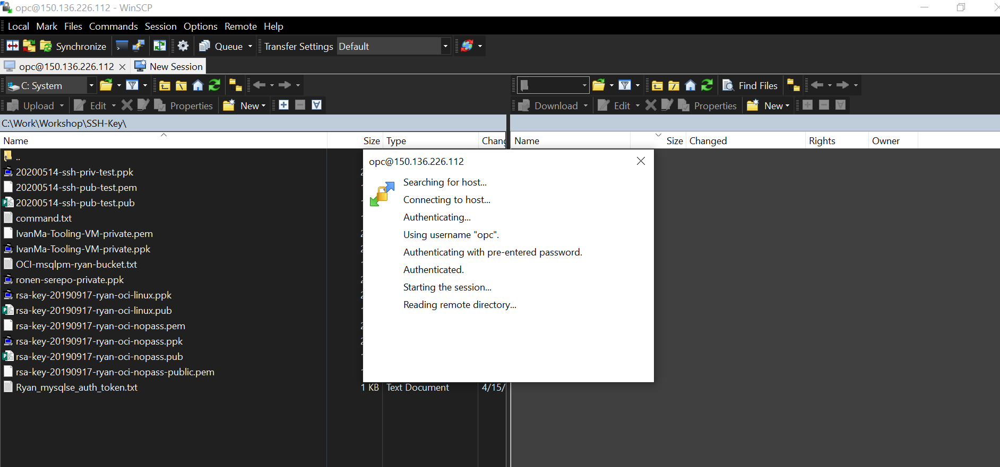

2. Change directory to ''/workshop/windows'' or ''/workshop/mac'', and select the install file and copy (drag-and-drop) to your local directory on the left window


### Configure MySQL Workbench

Once you have installed MySQL Workbench, you will need to configure a ``connection`` to the MySQL server running in OCI

1. Specify the ``ip address`` of OCI you are connecting to, and user ``opc`` and password assgined to you

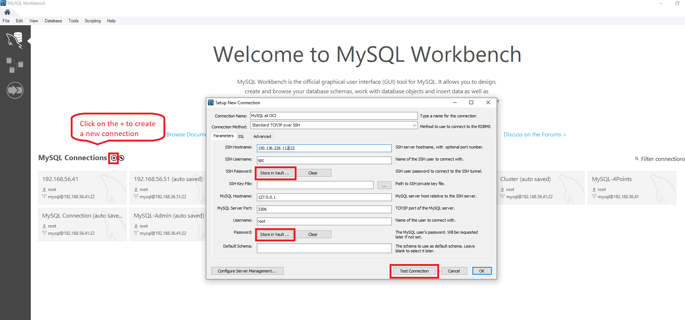

2. Store your password for convenience by clicking the ``store in vault``

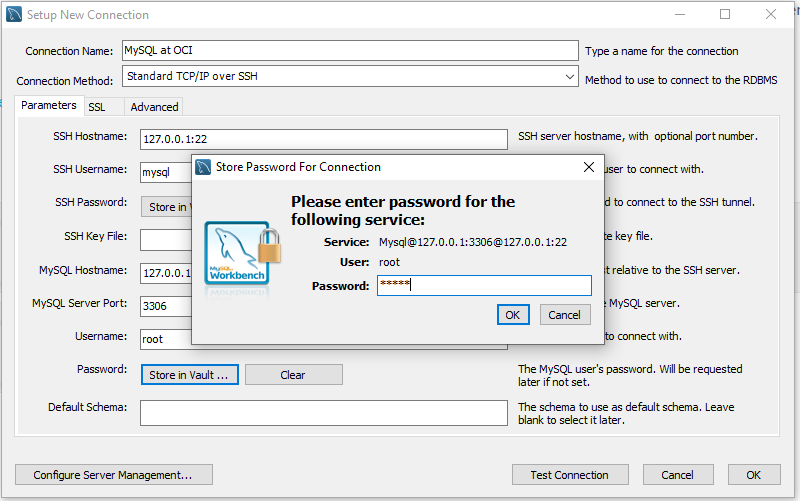

3. Test your connection

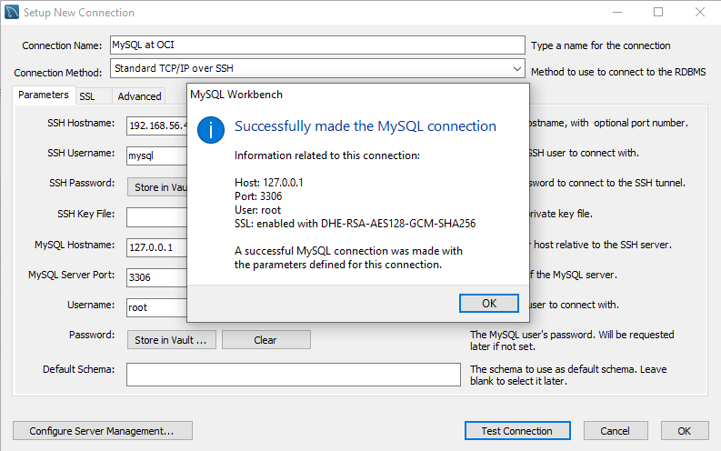

4. Once connection is tested successfully, we need to configure ``server management`` so that you can use Workbench to manage MySQL server

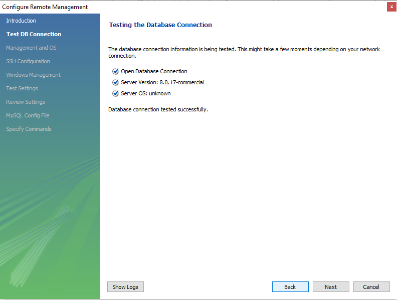

5. Select ``SSH login based management``, and ``Oracle Linux 7``

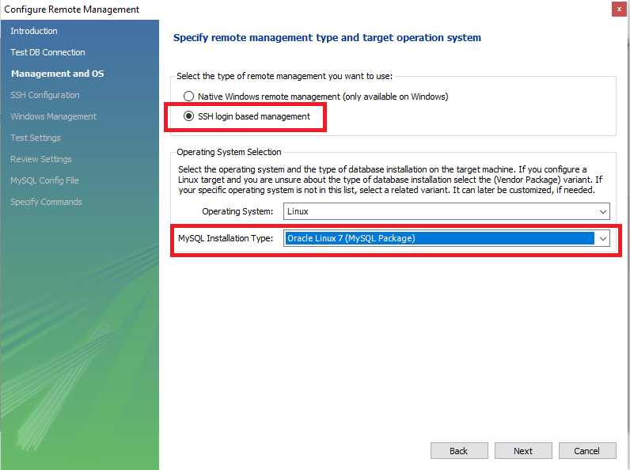

6. Specify your ssh login and password

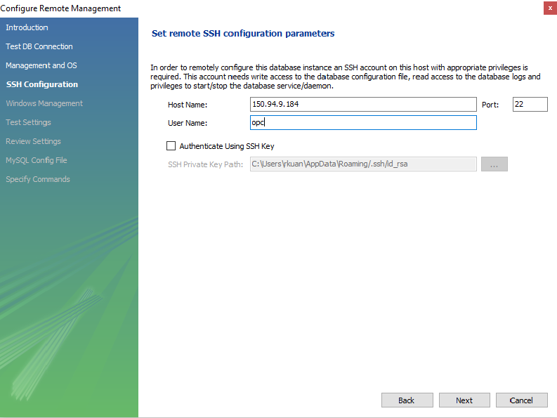

7. Once the ssh login is validated, you are done

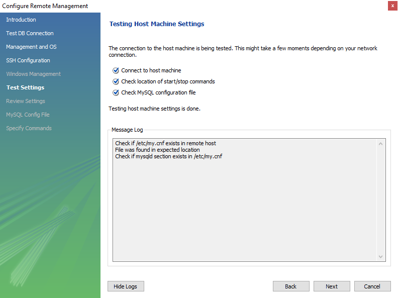


